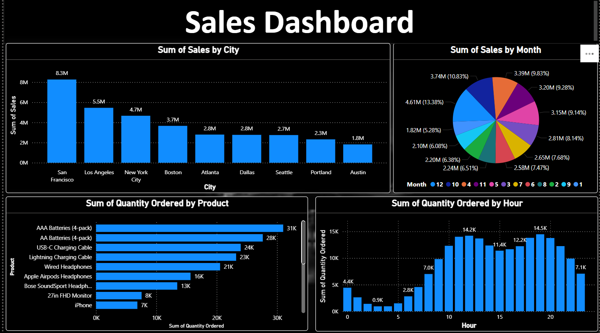
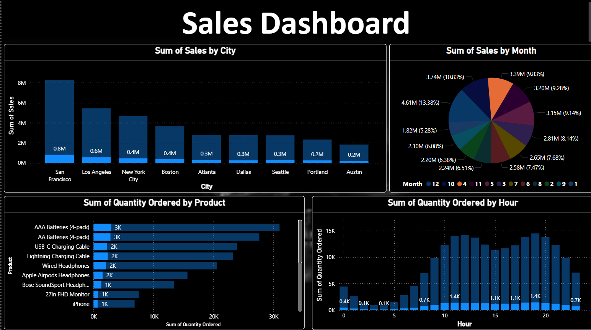
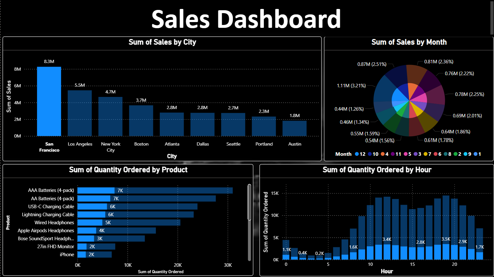

# 🚀 Sales Data Analysis with Power BI 📊

This project showcases how Power BI can be used to transform raw sales data into meaningful business intelligence. The goal was to analyze sales performance, identify trends, and build an interactive, user-friendly dashboard for data-driven decision-making.

## 🔍 Project Highlights

- ✅ Comprehensive data cleaning and preprocessing in Power Query
- 📈 Trend identification using time series visualizations
- 📊 Dynamic charts for region-wise and category-wise performance
- 🧠 KPI indicators for quick insights
- 🖱️ Interactive slicers and filters for custom analysis

## 📸 Dashboard Preview

  

## 📸 Sales By Month


## 📸 Sales By City


## 🛠️ Tools Used

- Microsoft Power BI
- Power Query
- DAX
- Excel (for data source)

## 📂 Project Structure

```plaintext
├── data/
│   └── sales_data.xlsx
├── report/
│   └── SalesDashboard.pbix
├── images/
│   └── dashboard_screenshot.png
├── README.md
